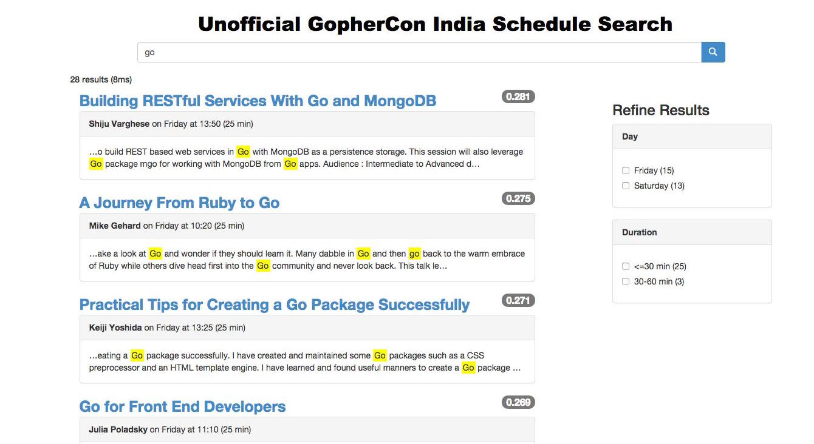
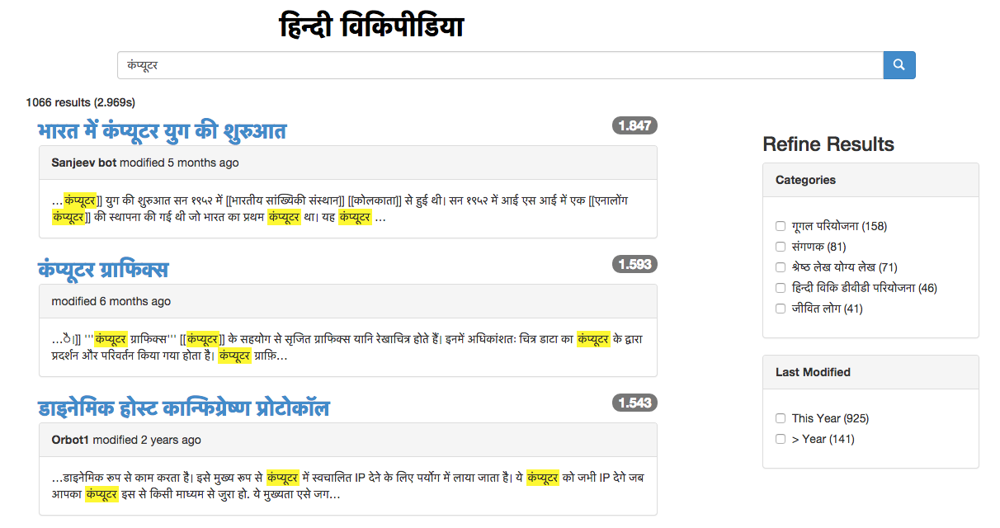

# bleve - modern text indexing for Go, Martin Schoch
Feb 21, 2015

*Marty (<a target="_blank" href="http://twitter.com/mschoch">@mschoch</a>) is an engineer at <a target="_blank" href="http://couchbase.com/">Couchbase</a>, a high-performance NoSQL distributed database.  Working with Go for almost 2 and half years, he has been using it to prototype new solutions at Couchbase.  This talk introduces <a target="_blank" href="http://www.blevesearch.com">bleve</a>, a text indexing library for Go.  The slides for this talk have been posted <a target="_blank" href="https://speakerdeck.com/mschoch/bleve-modern-text-indexing-for-go">here</a>.*

## Bleve

The Lucene/Solr/Elasticsearch ecosystem is great if you're already using Java/JVM, but we asked ourselves: 

    What if we combined 50% of Lucene's text analysis components with an off-the-shelf KV store?

* Initially focus on the most commonly used text analysis components
* Use Go interfaces so that users can fill in the gaps with components for their own languages/domains
* Avoid heavy lifting with a custom file format, lots of interesting KV stores to choose from (currently supported <a target="_blank" href="https://github.com/google/leveldb">LevelDB</a>, <a target="_blank" href="https://github.com/boltdb/bolt">Bolt</a>, <a target="_blank" href="https://github.com/couchbase/forestdb">ForestDB</a>)

Features supported:

* Index any Go structure (strings, numeric values, and dates supported)
* Search (Term, Phrase, Match, MatchPhrase, Boolean, Fuzzy, Numeric Range, Date Range)
* Search results with TF/IDF scoring, contextual snippets and term highlighting
* Search result faceting (term, numeric, date)

## Getting Started

Installing bleve is easy, the **go get** command installs the library.

    $ go get github.com/blevesearch/bleve/...

**NOTE**: including the trailing /... will also install some helpful command-line utilities.

In just 26 lines of code, we can create our first index:

<noscript>
<pre>
<code>package main

import (
	"log"

	"github.com/blevesearch/bleve"
)

type Person struct {
	Name string
}

func main() {
	mapping := bleve.NewIndexMapping()
	index, err := bleve.New("people.bleve", mapping)
	if err != nil {
		log.Fatal(err)
	}

	person := Person{"Marty Schoch"}
	err = index.Index("m1", person)
	if err != nil {
		log.Fatal(err)
	}
	log.Println("Indexed Document")
}</code>
</pre
</noscript>

The `mapping` is a default Index Mapping.  The Index Mapping is responsible for describing how your documents should be mapped into the index.  The default mapping is designed to work well out of the box, but you'll want to revisit this to improve the quality of your search results.

The call to the `New()` function takes two parameters, the first is the path to a directory where the index will be stored and the second is the `mapping` to be used for this index.

The call to the `Index()` method takes two parameters, the first is a unique identifier for the document, and the second is the document (a Go struct) to be indexed.

Now that we’ve created an index, we want to open it and search:

<noscript>
<pre>
<code>package main

import (
	"fmt"
	"log"

	"github.com/blevesearch/bleve"
)

type Person struct {
	Name string
}

func main() {
	index, err := bleve.Open("people.bleve")
	if err != nil {
		log.Fatal(err)
	}

	query := bleve.NewTermQuery("marty")
	request := bleve.NewSearchRequest(query)
	result, err := index.Search(request)
	if err != nil {
		log.Fatal(err)
	}
	fmt.Println(result)
}</code>
</pre
</noscript>

The call to the `Open()` function only takes a single parameter, the path to the index.  The mapping is not needed, as it was serialized into the index at the time of creation.

The `query` describes what we're looking for.  In this case it is a TermQuery, the simplest kind of query.  Term queries looks for an exact match of the specified term in the index.

The `request` describes how the results should be returned.  It can control how many results are returned, whether or not stored fields or facets should also be returned.  In this case we use a default request, which will return the first 10 matching documents.

When we run this example we get:

    $ ./search_index 
    1 matches, showing 1 through 1, took 70.722µs
        1. m1 (0.216978)

This shows the one document we put into the index does match this query.

## Indexing Real World Data

To see more of the features in action, let's index the <a target="_blank" href="http://www.gophercon.in/talk-schedule/">GopherCon India schedule</a>.  We'll map the data into the structure below:

<noscript>
<pre>
<code>type Event struct {
	UID         string    `json:"uid"`
	Summary     string    `json:"summary"`
	Description string    `json:"description"`
	Speaker     string    `json:"speaker"`
	Start       time.Time `json:"start"`
	Duration    float64   `json:"duration"`
}</code>
</pre
</noscript>

Now let's try a more interesting search.  This time we'll do a phrase search for "quality search results".

<noscript>
<pre>
<code>func PhraseSearch(index bleve.Index) {
	phrase := []string{"quality", "search", "results"}
	q := bleve.NewPhraseQuery(phrase, "description")
	req := bleve.NewSearchRequest(q)
	req.Highlight = bleve.NewHighlightWithStyle("ansi")
	req.Fields = []string{"summary", "speaker"}
	res, err := index.Search(req)
	if err != nil {
		log.Fatal(err)
	}
	fmt.Println(res)
}</code>
</pre
</noscript>

When we run this example we get:

    $ ./phrase_search_schedule 
    1 matches, showing 1 through 1, took 1.73394ms
        1. bleve_-_modern_text_indexing_for_go (1.033644)
    	description
		    …earch component. But delivering high quality search results requires a long list of text analysis and indexing techniques. With the bleve library, we bring advanced text indexing and search to your Go…
	    summary
		    bleve - modern text indexing for Go
	    speaker
		    Martin Schoch

Now let's try one more example.  So far all the queries we've executed have been built programmatically, but sometimes its useful to allow end users build their own queries.  To do this we use a QueryStringQuery:

<noscript>
<pre>
<code>func QueryStringSearch(index bleve.Index) {
	qString := `+description:text summary:"text indexing" summary:believe~2 -description:lucene duration:&lt;30`
	q := bleve.NewQueryStringQuery(qString)
	req := bleve.NewSearchRequest(q)
	req.Highlight = bleve.NewHighlightWithStyle("ansi")
	req.Fields = []string{"summary", "speaker", "description", "duration"}
	res, err := index.Search(req)
	if err != nil {
		log.Fatal(err)
	}
	fmt.Println(res)
}</code>
</pre
</noscript>

This particular QueryString shows many options in use:

* Prefixing with `+` or `-` changes that clause to a MUST or MUST NOT (default SHOULD)
* Prefixing with `fieldname:` restricts matches to a particular field (default _all)
* Place term in quotes results in a PhraseQuery
* Suffixing a term with ~N performs a FuzzyQuery with edit distance N (default 2)

When we run this example we get:

    $ ./query_string_search_schedule 
    1 matches, showing 1 through 1, took 10.540776ms
        1. bleve_-_modern_text_indexing_for_go (0.338882)
    	description
		    …ist of text analysis and indexing techniques. With the bleve library, we bring advanced text indexing and search to your Go applications. This talk will start with a brief introduction to text search …
	    summary
    		bleve - modern text indexing for Go
    	speaker
    		Martin Schoch
    	duration
		    25

## Putting it All Together

Bleve also includes a set of optional HTTP handlers.  These handlers map all the major bleve operations to HTTP requests and assume that your data and index mappings are encoded in JSON documents.  By combining the GopherCon India schedule index with these HTTP examples its very simple to build a web-based search.

Here we searched for the term "go":

We can see the search results include stored fields, snippets for the talk description, including highlighted matching terms.  Also on the right-hand side we see two facets, one for the day of the talk, and another for the duration of the talk.  By checking these boxes we can easily add/remove filters and drill deeper into the results.

A hosted version of the application is <a target="_blank" href="http://gopherconin.blevesearch.com/search/">available for you to try out yourself</a>.

## Roadmap

Bleve is still very much under active development.  However, a very useful set of functionality is already available.  We hope to wrap up a few key features and then prepare for a 1.0 stable release.

* Search Result Sorting (currently only by score)
* Improved Spelling Suggest / Fuzzy Search
* Performance (focus has been on features/API)

## One More Thing...

In anticipation of GopherCon India we created an initial analyzer for Hindi.  It's still experimental, but the foundation is in place for you to help make it better.  To test it out I put together a simple app which allows me to search the Hindi Wikipedia Export.  In the screenshot below you can see me searching for कंप्यूटर (Hindi for 'computer')

## Join the Community

The community around bleve is <a target="_blank" href="https://github.com/blevesearch/bleve/graphs/contributors">growing</a>.  We can't accomplish all of our goals for this project with building a community of users interested in improving support for their languages.  Join us at <a target="_blank" href="http://www.blevesearch.com">blevesearch.com</a>.
